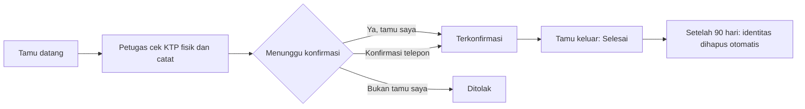

# 🏘️ Lapor Tamu RT 1x24 Jam

> Aplikasi web untuk mencatat dan mengonfirmasi tamu yang datang ke lingkungan RT dalam waktu 1x24 jam, dengan identitas tamu yang terlindungi.
>
> *A lightweight web app for neighborhood (RT) guest reporting within 24 hours, with role-based access and privacy-minded data handling.*

**Status:** 🌱 Prototipe tahap pembelajaran awal
**Dibuat untuk:** mengikuti lomba di kampus
**Kontak:** [hilfulwarday@gmail.com](mailto:hilfulwarday@gmail.com)

---

## 📌 Latar Belakang

Di banyak lingkungan RT, tamu yang menginap atau berkunjung wajib melapor ke pengurus dalam 1x24 jam. Prosesnya biasanya masih memakai buku tamu: sulit dicari, identitas tamu mudah terbaca siapa saja, dan tidak jelas siapa penanggung jawab tamu tersebut.

Proyek ini mencoba menjawabnya dengan alur sederhana:

1. Petugas pos mencatat tamu setelah **melihat KTP fisik** (KTP tidak difoto atau difotokopi).
2. **Tuan rumah** yang dituju mengonfirmasi bahwa ia mengenal tamu tersebut.
3. **Pengurus RT** memantau seluruh tamu, termasuk yang melewati batas 24 jam.

## ✨ Fitur

| Kategori | Fitur |
|---|---|
| **Pencatatan** | Form tamu dengan validasi NIK (16 digit, kode wilayah, tanggal lahir), nomor dokumen otomatis (`LT-RT09-20261007-0001`), pilihan identitas KTP / dokumen lain / tanpa identitas |
| **Konfirmasi** | Tuan rumah menjawab "Ya, tamu saya" atau "Bukan tamu saya" dengan alasan, atau petugas mencatat konfirmasi via telepon |
| **Pemantauan** | Status Menunggu, Terkonfirmasi, Ditolak, Selesai, penanda **Lewat 24 jam**, pencarian, filter status dan tanggal |
| **Keamanan** | NIK tersamarkan di semua tampilan, akses per peran, NIK lengkap hanya untuk pengurus dan selalu tercatat di log audit |
| **Privasi** | Penghapusan otomatis NIK, nomor identitas, dan No. HP setelah tamu selesai lebih dari 90 hari (dapat diatur) |
| **Darurat** | Teks berjalan berisi nomor darurat (112, 110, 113, 118/119, 115, 123) yang dapat diketuk untuk menelepon, isinya dapat diganti pengurus lewat tabel pengaturan |
| **Pengalaman pakai** | Tampilan mobile-first, mode gelap otomatis, dapat ditambahkan ke layar utama HP lewat `manifest.json` |

## 👥 Peran Pengguna

| Peran | Yang dapat dilakukan |
|---|---|
| **Petugas** | Mencatat tamu, mencatat konfirmasi via telepon, menandai tamu keluar |
| **Tuan rumah** | Melihat hanya tamu yang menuju rumahnya, mengonfirmasi atau menolak |
| **Pengurus RT** | Melihat semua tamu, membuka NIK lengkap (tercatat), membaca log audit, membersihkan data lama |

## 🔄 Alur Kerja



## 🧰 Teknologi

| Bagian | Pilihan |
|---|---|
| Tampilan | HTML, CSS, dan JavaScript murni, semuanya ditulis di dalam satu berkas `index.html` (tidak ada berkas `.css` atau `.js` terpisah, tanpa framework) |
| Pustaka eksternal | Hanya `supabase-js` (dimuat dari CDN) untuk terhubung ke database |
| Database dan login | [Supabase](https://supabase.com) (PostgreSQL, Auth, Row Level Security) |
| Hosting | [Vercel](https://vercel.com), otomatis deploy dari GitHub |
| Penjadwalan | `pg_cron` untuk pembersihan data harian |

Seluruh perubahan data melewati fungsi database (RPC) yang memeriksa peran pengguna, dan tabel utama tidak dapat diakses langsung dari aplikasi.

## 📁 Struktur Berkas

```
├── index.html            # Aplikasi (tampilan + logika)
├── manifest.json         # Pengaturan pemasangan di layar utama HP
├── icon.svg              # Ikon aplikasi
├── schema.sql            # Tahap 1: tabel dasar, nomor dokumen otomatis
├── perbaikan.sql         # Fase 1: pengaturan kode RT, pembatasan hak
├── tahap2a.sql           # Tahap 2A: peran, konfirmasi tuan rumah, tampilan aman
├── tahap2b.sql           # Tahap 2B: lihat NIK tercatat, log audit, tamu tanpa KTP
├── tahap2c.sql           # Tahap 2C: penghapusan data lama
├── tahap2c_jadwal.sql    # Jadwal otomatis harian (pg_cron)
└── contoh_7_rumah.sql    # Contoh data warga dan akun tuan rumah (fiktif)
```

## 🚀 Cara Menjalankan

1. **Buat project Supabase.** Di **SQL Editor**, jalankan berurutan: `schema.sql`, `perbaikan.sql`, `tahap2a.sql`, `tahap2b.sql`, `tahap2c.sql`, lalu `tahap2c_jadwal.sql` (terpisah).
2. **Ubah pengaturan** di tabel `pengaturan`: `kode_rt` (misal `RT09`) dan `nama_lingkungan`.
3. **Matikan pendaftaran bebas** di Authentication agar orang luar tidak bisa membuat akun.
4. **Buat akun** di Authentication > Users dengan email `ID@petugas.rt` (centang Auto Confirm), lalu beri peran:
   ```sql
   select daftarkan_akun('id_petugas', 'petugas', 'Nama Petugas');
   select daftarkan_akun('id_ketua',   'pengurus', 'Nama Ketua RT');
   select daftarkan_akun('id_warga',   'tuan_rumah', 'Nama Warga', 'Nama Warga di tabel warga');
   ```
5. **Isi dua baris** `SUPABASE_URL` dan `SUPABASE_KEY` di `index.html` dengan **Project URL** dan **publishable key** (bukan secret key).
6. **Unggah ke GitHub**, lalu hubungkan repositori ke Vercel (Framework Preset: *Other*) dan klik **Deploy**.

> ⚠️ Jangan pernah memasukkan `secret` atau `service_role` key ke repositori. Hanya publishable key yang aman berada di `index.html`, karena data dilindungi aturan akses di database.

## 🔒 Keamanan dan Privasi

Prinsip yang dipakai: **kumpulkan seperlunya, tampilkan seminimal mungkin, hapus bila sudah tidak perlu.**

- KTP **tidak** difoto atau difotokopi, hanya nomornya yang dicatat setelah dicocokkan dengan KTP fisik.
- NIK tersamarkan (`6471********0001`) dan NIK lengkap hanya dapat dibuka pengurus lewat fungsi khusus yang menulis log audit.
- Tuan rumah hanya melihat tamu rumahnya sendiri.
- Identitas tamu yang sudah selesai dihapus otomatis setelah masa simpan berakhir; nama dan riwayat kunjungan tetap ada untuk rekap.

**Catatan jujur:** proyek ini masih prototipe pembelajaran dan belum diaudit oleh pihak ketiga. Sebelum dipakai untuk data warga sungguhan, sebaiknya ditinjau oleh pihak yang berpengalaman di bidang keamanan dan disepakati bersama pengurus dan warga.

## ⚠️ Batasan yang Diketahui

- Akun memakai email bayangan `@petugas.rt`, sehingga **lupa password harus direset manual** oleh admin.
- Tamu tanpa identitas tidak punya NIK untuk dicocokkan, sehingga bisa tercatat ganda.
- Penambahan warga dan akun masih lewat SQL Editor dan dashboard Supabase.
- Belum ada notifikasi otomatis ke tuan rumah.
- Belum ada pengujian otomatis di dalam repositori.

## 🗺️ Rencana Pengembangan

- [x] Pencatatan tamu dan nomor dokumen otomatis
- [x] Peran pengguna dan konfirmasi tuan rumah
- [x] Log audit dan penghapusan data lama
- [ ] Tombol "Kabari via WhatsApp" ke tuan rumah
- [ ] Unduh rekap bulanan ke Excel
- [ ] Kelola warga dan akun langsung dari aplikasi
- [ ] Ganti password mandiri
- [ ] Bukti lapor cetak dengan QR code
- [ ] Cadangan data berkala

## 🖼️ Tangkapan Layar

<!-- Tambahkan gambar di sini, contoh:


-->

## 🤝 Kontak

Proyek ini dibuat sebagai bagian dari proses belajar dan untuk mengikuti lomba di kampus. Jika berminat berdiskusi, memberi masukan, atau berkolaborasi, silakan hubungi:

📧 **[hilfulwarday@gmail.com](mailto:hilfulwarday@gmail.com)**

Masukan dari pengurus RT, warga, maupun pengembang sangat diterima.

---

<sub>Seluruh nama warga dan data pada contoh adalah fiktif.</sub>
